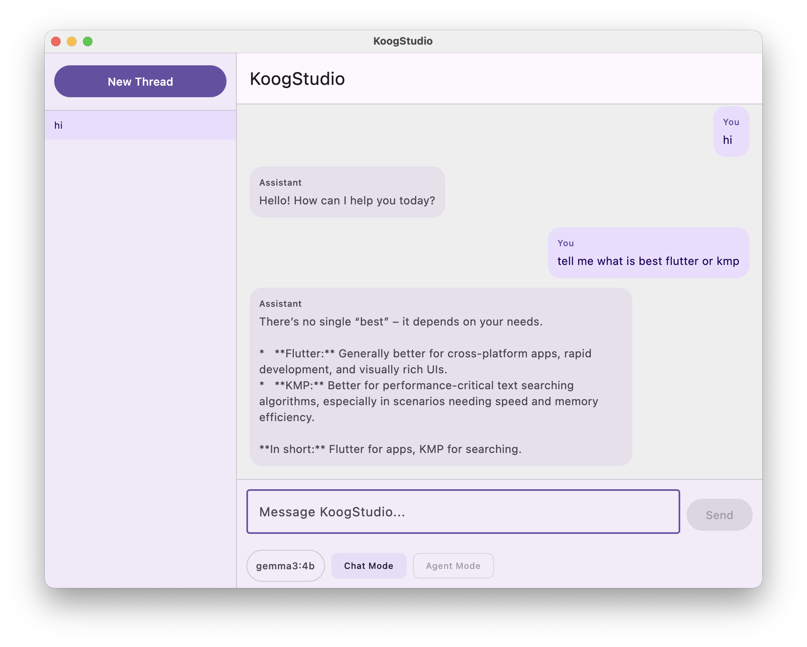

# KoogStudio

**Your AI-Powered Sales & Human Psychology Expert — Running Locally on Your Machine.**

KoogStudio is a desktop AI chat application built with Kotlin Multiplatform and Compose Multiplatform. It connects to a locally running Ollama server, giving you full-powered conversational AI with zero cloud dependency, zero API keys, and complete privacy.

---

## Screenshot

<p align="center">
  
</p>

---

## What Makes KoogStudio Different

This is not just another chat interface. KoogStudio is purpose-built as a **professional sales advisor and human psychology expert**. Whether you are closing deals, navigating complex negotiations, or understanding customer behavior at a deeper level, KoogStudio brings together the science of persuasion, emotional intelligence, and data-driven sales strategy into a single, private, local-first AI assistant.

### Core Expertise

- **Professional Sales Strategy** — Advanced sales methodologies including consultative selling, SPIN selling, Challenger framework, and value-based negotiation. KoogStudio helps you build pipelines, qualify leads, handle objections, and close with confidence.

- **Human Psychology & Behavioral Insights** — Deep understanding of cognitive biases, emotional triggers, decision-making frameworks, and persuasion principles. From Robert Cialdini's principles of influence to modern behavioral economics, KoogStudio applies psychological science to real-world selling.

- **Negotiation Mastery** — Anchoring, framing, loss aversion, reciprocity, and other psychological levers that shape every deal. Get tactical advice for high-stakes negotiations.

- **Client Relationship Intelligence** — Read people, decode body language cues, understand motivational drivers, and build lasting trust-based relationships with prospects and clients.

- **Communication & Persuasion** — Craft compelling pitches, handle tough objections, and communicate value in a way that resonates with how the human brain actually processes decisions.

---

## Features

| Feature | Description |
|---|---|
| **Local AI Backend** | Runs entirely on your machine via Ollama. No data leaves your computer. |
| **Multi-Thread Conversations** | Create and manage multiple conversation threads. Organize discussions by client, deal, or topic. |
| **Model Selector** | Switch between any Ollama model you have installed (e.g., `gemma3:4b`, `llama3`, `mistral`). |
| **Markdown Rendering** | AI responses render with rich Markdown — code blocks, bold, lists, and structured formatting. |
| **Persistent History** | All threads and messages are saved locally as JSON. Pick up exactly where you left off. |
| **Clean Desktop UI** | A modern Material Design 3 interface with a sidebar, chat bubbles, and an intuitive input bar. |

---

## Tech Stack

| Technology | Purpose |
|---|---|
| **Kotlin 2.4** | Primary language |
| **Compose Multiplatform 1.11** | Declarative UI framework (JetBrains) |
| **Koog Agents** | AI agent framework with Ollama integration |
| **Material Design 3** | UI components and theming |
| **Compose Rich Text** | Markdown rendering in chat |
| **Kotlinx Serialization** | Thread/message persistence |
| **Kotlinx Coroutines** | Async operations with Swing integration |
| **AndroidX ViewModel** | MVVM state management |
| **Gradle 9.1** | Build system with Kotlin DSL |

---

## Getting Started

### Prerequisites

- **JDK 17+** installed
- **Ollama** installed and running ([ollama.com](https://ollama.com))
- Pull at least one model:
  ```bash
  ollama pull gemma3:4b
  ```

### Run the App

**Standard run:**
```bash
./gradlew :desktopApp:run
```

**Hot reload (live preview):**
```bash
./gradlew :desktopApp:hotRun --auto
```

### Run Tests

```bash
./gradlew :shared:jvmTest
```

---

## Project Structure

```
KoogStudio/
├── desktopApp/                  # Desktop entry point (Compose Desktop window)
│   └── src/main/kotlin/.../main.kt
├── shared/                      # Shared module (all core logic lives here)
│   └── src/commonMain/kotlin/com/koog/studio/
│       ├── App.kt               # Root composable
│       ├── ChatScreen.kt        # Main chat UI layout
│       ├── ChatViewModel.kt     # Ollama integration, thread management
│       ├── ChatBubble.kt        # Message rendering (Markdown for AI)
│       ├── ChatInputBar.kt      # Input field, model picker, mode chips
│       ├── Sidebar.kt           # Thread navigation sidebar
│       ├── Thread.kt            # Thread data model
│       ├── ThreadStore.kt       # JSON persistence
│       ├── ChatMessage.kt       # Message data model
│       ├── TypingIndicator.kt   # Animated typing indicator
│       └── UserPreferences.kt   # Saved model/mode preferences
├── screenshots/                 # App screenshots
├── gradle/                      # Version catalog & wrapper
└── build.gradle.kts             # Root build configuration
```

---

## How It Works

1. **Start Ollama** on your machine with your preferred model loaded.
2. **Launch KoogStudio** — it auto-discovers available Ollama models.
3. **Create a thread** and start chatting. Ask about sales strategies, negotiation tactics, reading buyer psychology, or crafting the perfect pitch.
4. **Switch models** at any time using the model picker in the input bar.
5. **All conversations persist** locally — close and reopen without losing context.

---

## Why Local-First?

- **Privacy** — Your sales conversations, client strategies, and psychological insights never leave your machine.
- **No API Costs** — Run unlimited conversations without per-token billing.
- **Offline Ready** — Works without internet once Ollama and models are set up.
- **Full Control** — Choose any model, fine-tune prompts, and own your data.

---

## License

This project is open source. See the repository for details.

---

**Built with Kotlin Multiplatform & Compose Desktop. Powered by Ollama. Designed for professionals who understand that great selling starts with understanding people.**
