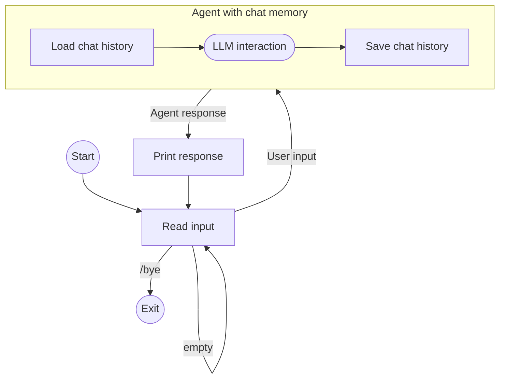

# Build a chat agent with memory

This guide demonstrates how to create a conversational command-line chat application
that remembers previous messages across multiple agent interactions using the [ChatMemory](index.md) feature.

The CLI application executes the following loop:

- Reads the input from the console
- If the input is not `/bye` or empty, it runs the agent with the user input and the specified session ID
- The agent first loads the previous conversation history for the session ID
  and adds the messages to the prompt in addition to the user input
- The agent performs the LLM interaction
- At the end of the run, before returning the response,
  the agent stores the full conversation history under the specified session ID,
  limiting the size to 20 latest messages
- The app then prints out the response from the agent

Here is an illustration:



## Code

??? note "Prerequisites"

    --8<-- "quickstart-snippets.md:prerequisites"

    Add the main [Koog agents package](https://central.sonatype.com/artifact/ai.koog/koog-agents/)
    and the [chat memory feature package](https://mvnrepository.com/artifact/ai.koog/agents-features-memory)
    as dependencies:

    === "Gradle (Kotlin)"
    
        ```kotlin title="build.gradle.kts"
        dependencies {
            implementation("ai.koog:koog-agents:1.0.0")
            implementation("ai.koog:agents-features-memory:1.0.0")
        }
        ```
    
    === "Gradle (Groovy)"
    
        ```groovy title="build.gradle"
        dependencies {
            implementation 'ai.koog:koog-agents:0.7.0'
            implementation 'ai.koog:agents-features-memory:0.7.0'
        }
        ```
    
    === "Maven"
    
        ```xml title="pom.xml"
        <dependency>
            <groupId>ai.koog</groupId>
            <artifactId>koog-agents-jvm</artifactId>
            <version>1.0.0</version>
        </dependency>
        <dependency>
            <groupId>ai.koog</groupId>
            <artifactId>agents-features-memory-jvm</artifactId>
            <version>0.7.0</version>
        </dependency>
        ```

    --8<-- "quickstart-snippets.md:api-key"

    Examples on this page assume that you have set the `OPENAI_API_KEY` environment variable.

=== "Kotlin"

    <!--- INCLUDE
    import ai.koog.agents.chatMemory.feature.ChatMemory
    import ai.koog.agents.chatMemory.feature.InMemoryChatHistoryProvider
    import ai.koog.agents.core.agent.AIAgent
    import ai.koog.prompt.executor.clients.openai.OpenAIModels
    import ai.koog.prompt.executor.llms.all.simpleOpenAIExecutor
    -->
    ```kotlin
    suspend fun main() {
        val sessionId = "my-conversation"

        simpleOpenAIExecutor(System.getenv("OPENAI_API_KEY")).use { executor ->
            val agent = AIAgent(
                promptExecutor = executor,
                llmModel = OpenAIModels.Chat.GPT5_2,
                systemPrompt = "You are a helpful assistant."
            ) {
                install(ChatMemory) {
                    windowSize(20) // keep only the last 20 messages
                }
            }

            while (true) {
                print("You: ")
                val input = readln().trim()
                if (input == "/bye") break
                if (input.isEmpty()) continue

                val reply = agent.run(input, sessionId)
                println("Assistant: $reply\n")
            }
        }
    }
    ```

=== "Java"

    ```java
    public class ExampleChatAgentOpenAI {
        public static void main(String[] args) {
            String sessionId = "my-conversation";
    
            try (var executor = simpleOpenAIExecutor(System.getenv("OPENAI_API_KEY"))) {
                AIAgent<String, String> agent = AIAgent.builder()
                        .promptExecutor(executor)
                        .llmModel(OpenAIModels.Chat.GPT5_2)
                        .systemPrompt("You are a helpful assistant.")
                        .install(ChatMemory.Feature, config -> {
                            config.windowSize(20); // keep only the last 20 messages
                        })
                        .build();
    
                Scanner scanner = new Scanner(System.in);
                while (true) {
                    System.out.print("You: ");
                    String input = scanner.nextLine().trim();
                    if (input.equals("/bye")) break;
                    if (input.isEmpty()) continue;
    
                    String reply = agent.run(input, sessionId);
                    System.out.println("Assistant: " + reply + "\n");
                }
            } catch (Exception e) {
                e.printStackTrace();
            }
        }
    }
    ```

## Implementation details

The second argument to `agent.run()` is the [session ID](index.md#session-ids)
used to identify and differentiate between ongoing conversations.
In our example, it is constant because there is only one conversation at a time.
In a real application, you can have a separate unique ID for conversations related to the same user, for example.

The agent uses the default [history provider](index.md#history-providers)
that stores the conversation history in memory.
This means that the history is lost when the application exits.
In a real application, you should implement a custom history provider
to persistently store the history in a database or a file.

The `windowSize(20)` [preprocessor](index.md#preprocessors) ensures a limited context size:
the agent stores only up to 20 most recent messages.
Without this, the prompt size can grow beyond the context limit.

## Example session

```
You: My name is Alice.
Assistant: Nice to meet you, Alice! How can I help you today?

You: What's my favorite color? It's blue.
Assistant: Got it — your favorite color is blue!

You: What's my name?
Assistant: Your name is Alice!
```

Even though each interaction is a separate agent run, the agent correctly answers "Your name is Alice!"
because the `ChatMemory` feature loaded earlier exchanges before processing the third message.
