# Predefined nodes and components

Nodes are the fundamental building blocks of agent workflows in the Koog framework.
Each node represents a specific operation or transformation in the workflow, and they can be connected using edges to define the flow of execution.

In general, nodes let you encapsulate complex logic into reusable components that can be easily integrated into
different agent workflows. This guide will walk you through the existing nodes that can be used in your agent
strategies.

Each node is essentially a function (Kotlin) or action (Java) that takes an input of a specific type and returns an output of a specific type.

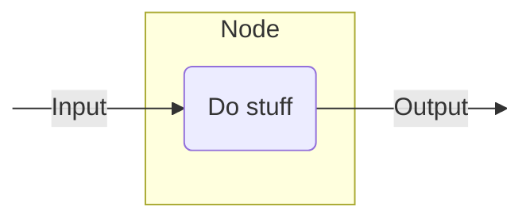
<!--- KNIT example-nodes-and-component-01.txt -->


Here is how you can define a node that expects a string as input and returns the length of the string (an integer) as output:

=== "Kotlin"
    <!--- INCLUDE
    import ai.koog.agents.core.dsl.builder.strategy
    import ai.koog.agents.core.dsl.builder.node
    val strategy = strategy<String, String>("strategy_name") {
    -->
    <!--- SUFFIX
    }
    -->
    ```kotlin
    val nodeLength by node<String, Int> { input ->
        input.length
    }
    ```
    <!--- KNIT example-nodes-and-component-01.kt -->

=== "Java"

    <!--- INCLUDE
    import ai.koog.agents.core.agent.entity.AIAgentGraphStrategy;
    import ai.koog.agents.core.agent.entity.AIAgentNode;
    class exampleNodesAndComponentsJava01 {
        public static void main(String[] args) {
    -->
    <!--- SUFFIX
        }
    }
    -->
    ```java
    var nodeLength = AIAgentNode.builder("nodeLength")
        .withInput(String.class)
        .withOutput(Integer.class)
        .withAction((input, ctx) -> input.length())
        .build();
    ```
    <!--- KNIT exampleNodesAndComponentsJava01.java -->

For more information, see [node()](api:agents-core::ai.koog.agents.core.dsl.builder.node) (Kotlin) or [AIAgentNode.builder()](api:agents-core::ai.koog.agents.core.agent.entity.AIAgentNode.Companion.builder) for Java.

## Utility nodes

### Pass-through node

A simple pass-through node that does nothing and returns the input as output. For details, see [nodeDoNothing](api:agents-core::ai.koog.agents.core.dsl.extension.nodeDoNothing) (Kotlin) or [AIAgentNode.doNothing()](api:agents-core::ai.koog.agents.core.agent.entity.AIAgentNode.Companion.doNothing) (Java).

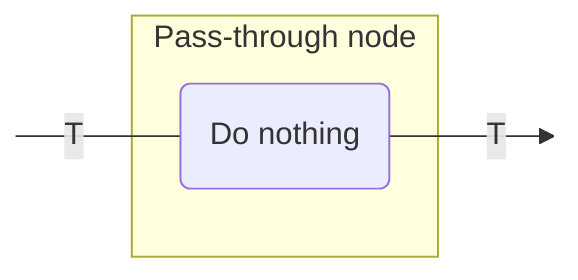
<!--- KNIT example-nodes-and-component-02.txt -->

You can use this node for the following purposes:

- Create a placeholder node in your graph.
- Create a connection point without modifying the data.

Here is an example:

=== "Kotlin"

    <!--- INCLUDE
    import ai.koog.agents.core.dsl.builder.strategy
    import ai.koog.agents.core.dsl.builder.node
    import ai.koog.agents.core.dsl.extension.nodeDoNothing
    val strategy = strategy<String, String>("strategy_name") {
    -->
    <!--- SUFFIX
    }
    -->
    ```kotlin
    val passthrough by nodeDoNothing<String>("passthrough")

    edge(nodeStart forwardTo passthrough)
    edge(passthrough forwardTo nodeFinish)
    ```
    <!--- KNIT example-nodes-and-component-02.kt -->

=== "Java"
    
    <!--- INCLUDE
    import ai.koog.agents.core.agent.entity.AIAgentGraphStrategy;
    import ai.koog.agents.core.agent.entity.AIAgentNode;
    class exampleNodesAndComponentsJava02 {
        public static void main(String[] args) {
            var strategy = AIAgentGraphStrategy.builder("strategy_name")
                .withInput(String.class)
                .withOutput(String.class);
    -->
    <!--- SUFFIX
        }
    }
    -->
    ```java
    var passthrough = AIAgentNode.builder("passthrough")
        .withInput(String.class)
        .withOutput(String.class)
        .withAction((input, ctx) -> input)
        .build();

    strategy.edge(strategy.nodeStart, passthrough);
    strategy.edge(passthrough, strategy.nodeFinish);
    ```
    <!--- KNIT exampleNodesAndComponentsJava02.java -->

## LLM nodes

### Prompt preparation node

**A node that adds messages to the LLM prompt using the provided prompt builder.
This is useful for modifying the conversation context before making an actual LLM request.** For details, see [nodeAppendPrompt](api:agents-core::ai.koog.agents.core.dsl.extension.nodeAppendPrompt) (Kotlin) or [AIAgentNode.appendPrompt()](api:agents-core::ai.koog.agents.core.agent.entity.AIAgentNodeBuilderWithInput.appendPrompt
) (Java).

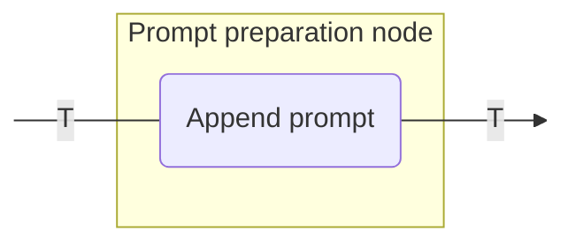
<!--- KNIT example-nodes-and-component-03.txt -->

You can use this node for the following purposes:

- Add system instructions to the prompt.
- Insert user messages into the conversation.
- Prepare the context for subsequent LLM requests.

Here is an example:

=== "Kotlin"

    <!--- INCLUDE
    import ai.koog.agents.core.dsl.builder.strategy
    import ai.koog.agents.core.dsl.builder.node
    import ai.koog.agents.core.dsl.extension.nodeAppendPrompt
    typealias Input = Unit
    typealias Output = Unit
    val strategy = strategy<String, String>("strategy_name") {
    -->
    <!--- SUFFIX
    }
    -->
    ```kotlin
    val firstNode by node<Input, Output> {
        // Transform input to output
    }

    val secondNode by node<Output, Output> {
        // Transform output to output
    }

    // Node will get the value of type Output as input from the previous node and path through it to the next node
    val setupContext by nodeAppendPrompt<Output>("setupContext") {
        system("You are a helpful assistant specialized in Kotlin programming.")
        user("I need help with Kotlin coroutines.")
    }

    edge(firstNode forwardTo setupContext)
    edge(setupContext forwardTo secondNode)
    ```
    <!--- KNIT example-nodes-and-component-03.kt -->

=== "Java"

    <!--- INCLUDE
    import ai.koog.agents.core.agent.entity.AIAgentGraphStrategy;
    import ai.koog.agents.core.agent.entity.AIAgentNode;
    class exampleNodesAndComponentsJava03 {
        class Output {}
        class Input extends Output { }
        public static void main(String[] args) {
            var strategy = AIAgentGraphStrategy.builder("strategy_name")
                .withInput(String.class)
                .withOutput(String.class);
    -->
    <!--- SUFFIX
        }
    }
    -->
    ```java
    var firstNode = AIAgentNode.builder()
        .withInput(Input.class)
        .withOutput(Output.class)
        .withAction((input, ctx) -> {
            // Transform input to output
            return input;
        })
        .build();

    var secondNode = AIAgentNode.builder()
        .withInput(Output.class)
        .withOutput(Output.class)
        .withAction((output, ctx) -> {
            // Transform output to output
            return output;
        })
        .build();

    var setupContext = AIAgentNode.builder()
        .withInput(Output.class)
        .appendPrompt(prompt -> {
            prompt.system("You are a helpful assistant specialized in Kotlin programming.");
            prompt.user("I need help with Kotlin coroutines.");
        });

    strategy.edge(firstNode, setupContext);
    strategy.edge(setupContext, secondNode);
    ```
    <!--- KNIT exampleNodesAndComponentsJava03.java -->

### Tool-only node

A node that appends a user message to the LLM prompt and gets a response where the LLM can only call tools. For details, see [nodeLLMSendMessageOnlyCallingTools](api:agents-core::ai.koog.agents.core.dsl.extension.nodeLLMSendMessageOnlyCallingTools) (Kotlin) or [AIAgentNode.llmSendMessageOnlyCallingTools()](api:agents-core::ai.koog.agents.core.agent.entity.AIAgentNode.Companion.llmSendMessageOnlyCallingTools) (Java).

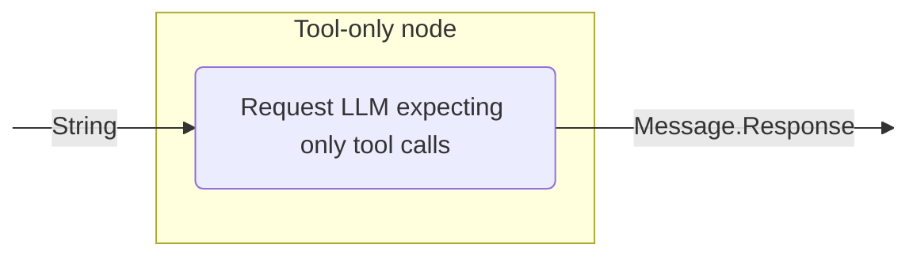
<!--- KNIT example-nodes-and-component-04.txt -->

### Forced single tool use node

A node that that appends a user message to the LLM prompt and forces the LLM to use a specific tool. For details, see [nodeLLMSendMessageForceOneTool](api:agents-core::ai.koog.agents.core.dsl.extension.nodeLLMSendMessageForceOneTool) (Kotlin) or [AIAgentNode.llmSendMessageForceOneTool()](api:agents-core::ai.koog.agents.core.agent.entity.AIAgentNode.Companion.llmSendMessageForceOneTool) (Java).

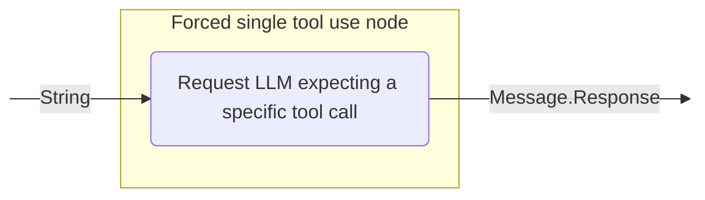
<!--- KNIT example-nodes-and-component-05.txt -->

### LLM request node

A node that appends a user message to the LLM prompt and gets a response with optional tool usage. The node configuration determines whether
tool calls are allowed during the processing of the message. For details, see [nodeLLMRequest](api:agents-core::ai.koog.agents.core.dsl.extension.nodeLLMRequest) (Kotlin) or [AIAgentNode.llmRequest()](api:agents-core::ai.koog.agents.core.agent.entity.AIAgentNode.Companion.llmRequest) (Java).

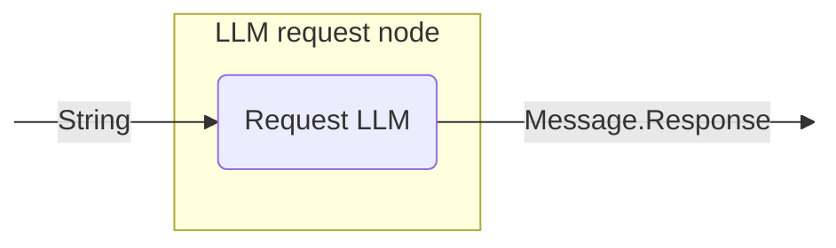
<!--- KNIT example-nodes-and-component-06.txt -->

You can use this node for the following purposes:

- Generate LLM response for the current prompt, controlling if the LLM is allowed to generate tool calls.

Here is an example:

=== "Kotlin"

    <!--- INCLUDE
    import ai.koog.agents.core.dsl.builder.strategy
    import ai.koog.agents.core.dsl.builder.node
    import ai.koog.agents.core.dsl.extension.nodeLLMRequest
    import ai.koog.agents.core.dsl.extension.nodeDoNothing
    val strategy = strategy<String, String>("strategy_name") {
        val getUserQuestion by nodeDoNothing<String>()
    -->
    <!--- SUFFIX
    }
    -->
    ```kotlin
    val requestLLM by nodeLLMRequest("requestLLM")
    edge(getUserQuestion forwardTo requestLLM)
    ```
    <!--- KNIT example-nodes-and-component-04.kt -->

=== "Java"

    <!--- INCLUDE
    import ai.koog.agents.core.agent.entity.AIAgentEdge;
    import ai.koog.agents.core.agent.entity.AIAgentGraphStrategy;
    import ai.koog.agents.core.agent.entity.AIAgentNode;
    class exampleNodesAndComponentsJava04 {
        public static void main(String[] args) {
            var strategy = AIAgentGraphStrategy.builder("strategy_name")
                .withInput(String.class)
                .withOutput(String.class);
            var getUserQuestion = AIAgentNode.builder("getUserQuestion")
                .withInput(String.class)
                .withOutput(String.class)
                .withAction((input, ctx) -> input)
                .build();
    -->
    <!--- SUFFIX
        }
    }
    -->
    ```java
    var requestLLM = AIAgentNode.llmRequest("requestLLM");

    strategy.edge(AIAgentEdge.builder()
        .from(getUserQuestion)
        .to(requestLLM)
        .build());
    ```
    <!--- KNIT exampleNodesAndComponentsJava04.java -->

### LLM request node with structured response

A node that appends a user message to the LLM prompt and requests structured data from the LLM with error correction capabilities. For details, see [nodeLLMRequestStructured](api:agents-core::ai.koog.agents.core.dsl.extension.nodeLLMRequestStructured) (Kotlin) or [AIAgentNode.llmRequestStructured()](api:agents-core::ai.koog.agents.core.agent.entity.AIAgentNode.Companion.llmRequestStructured) (Java).

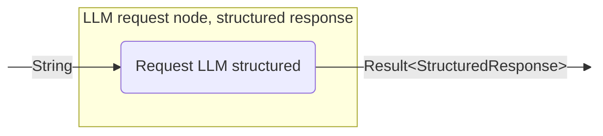
<!--- KNIT example-nodes-and-component-07.txt -->

### LLM request node with streaming response

A node that appends a user message to the LLM prompt and streams LLM response with or without stream data transformation. For details, see [nodeLLMRequestStreaming](api:agents-core::ai.koog.agents.core.dsl.extension.nodeLLMRequestStreaming) (Kotlin) or [AIAgentNode.llmRequestStreaming()](api:agents-core::ai.koog.agents.core.agent.entity.AIAgentNode.Companion.llmRequestStreaming) (Java).

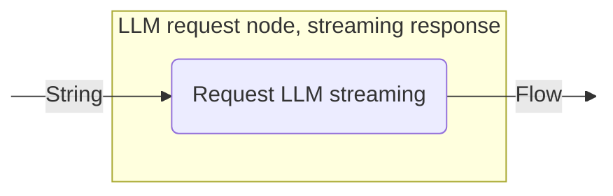
<!--- KNIT example-nodes-and-component-08.txt -->

### LLM request node with multiple responses

A node that appends a user message to the LLM prompt and gets multiple LLM responses with tool calls enabled. For details, see [nodeLLMRequest](api:agents-core::ai.koog.agents.core.dsl.extension.nodeLLMRequest) (Kotlin) or [AIAgentNode.llmRequest()](api:agents-core::ai.koog.agents.core.agent.entity.AIAgentNode.Companion.llmRequest) (Java).

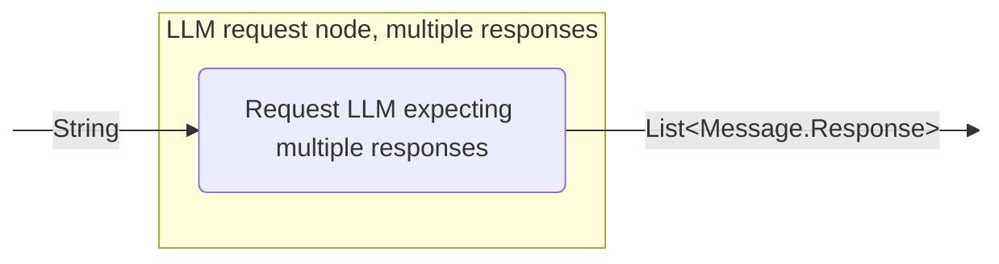
<!--- KNIT example-nodes-and-component-09.txt -->

You can use this node for the following purposes:

- Handle complex queries that require multiple tool calls.
- Generate multiple tool calls.
- Implement a workflow that requires multiple parallel actions.

Here is an example:

=== "Kotlin"

    <!--- INCLUDE
    import ai.koog.agents.core.dsl.builder.strategy
    import ai.koog.agents.core.dsl.builder.node
    import ai.koog.agents.core.dsl.extension.nodeLLMRequest
    import ai.koog.agents.core.dsl.extension.nodeDoNothing
    val strategy = strategy<String, String>("strategy_name") {
        val getComplexUserQuestion by nodeDoNothing<String>()
    -->
    <!--- SUFFIX
    }
    -->
    ```kotlin
    val requestLLMMultipleTools by nodeLLMRequest()
    edge(getComplexUserQuestion forwardTo requestLLMMultipleTools)
    ```
    <!--- KNIT example-nodes-and-component-05.kt -->

=== "Java"

    <!--- INCLUDE
    import ai.koog.agents.core.agent.entity.AIAgentEdge;
    import ai.koog.agents.core.agent.entity.AIAgentGraphStrategy;
    import ai.koog.agents.core.agent.entity.AIAgentNode;
    class exampleNodesAndComponentsJava05 {
        public static void main(String[] args) {
            var strategy = AIAgentGraphStrategy.builder("strategy_name")
                .withInput(String.class)
                .withOutput(String.class);
            var getComplexUserQuestion = AIAgentNode.builder("getComplexUserQuestion")
                .withInput(String.class)
                .withOutput(String.class)
                .withAction((input, ctx) -> input)
                .build();
    -->
    <!--- SUFFIX
        }
    }
    -->
    ```java
    var requestLLMMultipleTools = AIAgentNode.llmRequest("requestLLMMultipleTools");

    strategy.edge(AIAgentEdge.builder()
        .from(getComplexUserQuestion)
        .to(requestLLMMultipleTools)
        .build());
    ```
    <!--- KNIT exampleNodesAndComponentsJava05.java -->

### History compression node

A node that compresses the current LLM prompt (message history) into a summary, replacing messages with a concise summary (TL;DR). This is useful for managing long conversations by compressing the history to reduce token usage. For details, see [nodeLLMCompressHistory](api:agents-core::ai.koog.agents.core.dsl.extension.nodeLLMCompressHistory) (Kotlin) or [AIAgentNode.llmCompressHistory()](api:agents-core::ai.koog.agents.core.agent.entity.AIAgentNode.Companion.llmCompressHistory) (Java).

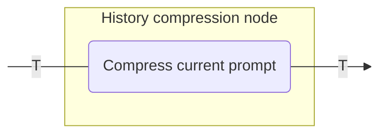
<!--- KNIT example-nodes-and-component-10.txt -->

To learn more about history compression, see [History compression](history-compression.md).

You can use this node for the following purposes:

- Manage long conversations to reduce token usage.
- Summarize conversation history to maintain context.
- Implement memory management in long-running agents.

Here is an example:

=== "Kotlin"

    <!--- INCLUDE
    import ai.koog.agents.core.dsl.builder.strategy
    import ai.koog.agents.core.dsl.builder.node
    import ai.koog.agents.core.dsl.extension.nodeLLMCompressHistory
    import ai.koog.agents.core.dsl.extension.nodeDoNothing
    import ai.koog.agents.core.dsl.extension.HistoryCompressionStrategy
    val strategy = strategy<String, String>("strategy_name") {
        val generateHugeHistory by nodeDoNothing<String>()
    -->
    <!--- SUFFIX
    }
    -->
    ```kotlin
    val compressHistory by nodeLLMCompressHistory<String>(
        "compressHistory",
        strategy = HistoryCompressionStrategy.FromLastNMessages(10),
        preserveMemory = true
    )
    edge(generateHugeHistory forwardTo compressHistory)
    ```
    <!--- KNIT example-nodes-and-component-06.kt -->

=== "Java"
    
    <!--- INCLUDE
    import ai.koog.agents.core.agent.entity.AIAgentGraphStrategy;
    import ai.koog.agents.core.agent.entity.AIAgentNode;
    class exampleNodesAndComponentsJava06 {
        public static void main(String[] args) {
            var strategy = AIAgentGraphStrategy.builder("strategy_name")
                .withInput(String.class)
                .withOutput(String.class);
            var generateHugeHistory = AIAgentNode.builder("generateHugeHistory")
                .withInput(String.class)
                .withOutput(String.class)
                .withAction((input, ctx) -> input)
                .build();
    -->
    <!--- SUFFIX
        }
    }
    -->
    ```java
    var compressHistory = AIAgentNode.llmCompressHistory("compressHistory")
        .withInput(String.class)
        .build();

    strategy.edge(generateHugeHistory, compressHistory);
    ```
    <!--- KNIT exampleNodesAndComponentsJava06.java -->

## Tool nodes

### Tool execution node

A node that executes a single tool call and returns its result. This node is used to handle tool calls made by the LLM. For details, see [nodeExecuteTool](api:agents-core::ai.koog.agents.core.dsl.extension.nodeExecuteTool) (Kotlin) or [AIAgentNode.executeTool()](api:agents-core::ai.koog.agents.core.agent.entity.AIAgentNode.Companion.executeTool) (Java).

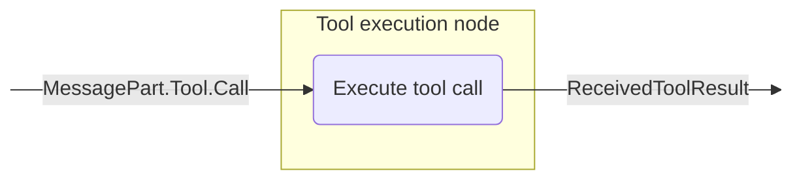
<!--- KNIT example-nodes-and-component-11.txt -->

You can use this node for the following purposes:

- Execute tools requested by the LLM.
- Handle specific actions in response to LLM decisions.
- Integrate external functionality into the agent workflow.

Here is an example:

=== "Kotlin"

    <!--- INCLUDE
    import ai.koog.agents.core.dsl.builder.strategy
    import ai.koog.agents.core.dsl.builder.node
    import ai.koog.agents.core.dsl.extension.nodeExecuteTools
    import ai.koog.agents.core.dsl.extension.nodeLLMRequest
    import ai.koog.agents.core.dsl.extension.onToolCalls
    val strategy = strategy<String, String>("strategy_name") {
    -->
    <!--- SUFFIX
    }
    -->
    ```kotlin
    val requestLLM by nodeLLMRequest()
    val executeTool by nodeExecuteTools()
    edge(requestLLM forwardTo executeTool onToolCalls { true })
    ```
    <!--- KNIT example-nodes-and-component-07.kt -->

=== "Java"

    <!--- INCLUDE
    import ai.koog.agents.core.agent.entity.AIAgentGraphStrategy;
    import ai.koog.agents.core.agent.entity.AIAgentNode;
    import ai.koog.agents.core.agent.entity.AIAgentEdge;
    import ai.koog.prompt.message.Message;
    import ai.koog.prompt.message.MessagePart;
    class exampleNodesAndComponentsJava07 {
        public static void main(String[] args) {
            var strategy = AIAgentGraphStrategy.builder("strategy_name")
                .withInput(String.class)
                .withOutput(String.class);
    -->
    <!--- SUFFIX
        }
    }
    -->
    ```java
    var requestLLM = AIAgentNode.llmRequest("requestLLM");
    var executeTool = AIAgentNode.executeTools("executeTool");

    strategy.edge(AIAgentEdge.builder()
        .from(requestLLM)
        .to(executeTool)
        .onToolCalls()
        .build());
    ```
    <!--- KNIT exampleNodesAndComponentsJava07.java -->

### Tool result follow-up node

A node that adds a tool result to the prompt and requests an LLM response. For details, see [nodeLLMSendToolResult](api:agents-core::ai.koog.agents.core.dsl.extension.nodeLLMSendToolResult) (Kotlin) or [AIAgentNode.llmSendToolResult()](api:agents-core::ai.koog.agents.core.agent.entity.AIAgentNode.Companion.llmSendToolResult) (Java).

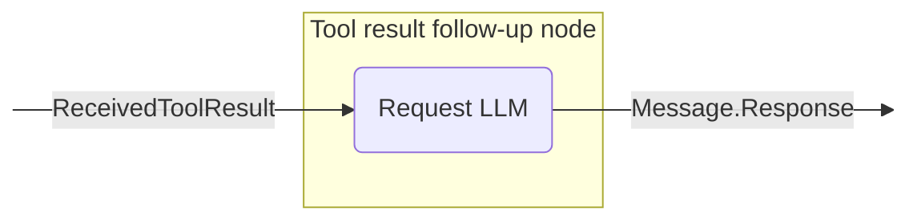
<!--- KNIT example-nodes-and-component-12.txt -->

You can use this node for the following purposes:

- Process the results of tool executions.
- Generate responses based on tool outputs.
- Continue a conversation after tool execution.

Here is an example:

=== "Kotlin"

    <!--- INCLUDE
    import ai.koog.agents.core.dsl.builder.strategy
    import ai.koog.agents.core.dsl.builder.node
    import ai.koog.agents.core.dsl.extension.nodeExecuteTools
    import ai.koog.agents.core.dsl.extension.nodeLLMSendToolResults
    val strategy = strategy<String, String>("strategy_name") {
    -->
    <!--- SUFFIX
    }
    -->
    ```kotlin
    val executeTool by nodeExecuteTools()
    val sendToolResultToLLM by nodeLLMSendToolResults()
    edge(executeTool forwardTo sendToolResultToLLM)
    ```
    <!--- KNIT example-nodes-and-component-08.kt -->

=== "Java"
    
    <!--- INCLUDE
    import ai.koog.agents.core.agent.entity.AIAgentGraphStrategy;
    import ai.koog.agents.core.agent.entity.AIAgentNode;
    class exampleNodesAndComponentsJava08 {
        public static void main(String[] args) {
            var strategy = AIAgentGraphStrategy.builder("strategy_name")
                .withInput(String.class)
                .withOutput(String.class);
    -->
    <!--- SUFFIX
        }
    }
    -->
    ```java
    var executeTool = AIAgentNode.executeTools("executeTool");
    var sendToolResultToLLM = AIAgentNode.llmSendToolResults("sendToolResultToLLM");

    strategy.edge(executeTool, sendToolResultToLLM);
    ```
    <!--- KNIT exampleNodesAndComponentsJava08.java -->

### Multi-tool execution node

A node that executes multiple tool calls. These calls can optionally be executed in parallel. For details, see [nodeExecuteMultipleTools](api:agents-core::ai.koog.agents.core.dsl.extension.nodeExecuteMultipleTools) (Kotlin) or [AIAgentNode.executeMultipleTools()](api:agents-core::ai.koog.agents.core.agent.entity.AIAgentNode.Companion.executeMultipleTools) (Java).

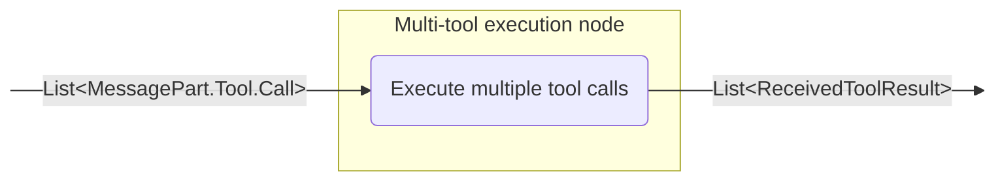
<!--- KNIT example-nodes-and-component-13.txt -->

You can use this node for the following purposes:

- Execute multiple tools in parallel.
- Handle complex workflows that require multiple tool executions.
- Optimize performance by batching tool calls.

Here is an example:

=== "Kotlin"

    <!--- INCLUDE
    import ai.koog.agents.core.dsl.builder.strategy
    import ai.koog.agents.core.dsl.builder.node
    import ai.koog.agents.core.dsl.extension.nodeLLMRequest
    import ai.koog.agents.core.dsl.extension.nodeExecuteTools
    import ai.koog.agents.core.dsl.extension.onToolCalls
    val strategy = strategy<String, String>("strategy_name") {
    -->
    <!--- SUFFIX
    }
    -->
    ```kotlin
    val requestLLMMultipleTools by nodeLLMRequest()
    val executeMultipleTools by nodeExecuteTools(parallel = true)
    edge(requestLLMMultipleTools forwardTo executeMultipleTools onToolCalls { true })
    ```
    <!--- KNIT example-nodes-and-component-09.kt -->

=== "Java"

    <!--- INCLUDE
    import ai.koog.agents.core.agent.entity.AIAgentGraphStrategy;
    import ai.koog.agents.core.agent.entity.AIAgentNode;
    import ai.koog.agents.core.agent.entity.AIAgentEdge;
    import ai.koog.prompt.message.Message;
    import ai.koog.prompt.message.MessagePart;
    class exampleNodesAndComponentsJava09 {
        public static void main(String[] args) {
            var strategy = AIAgentGraphStrategy.builder("strategy_name")
                .withInput(String.class)
                .withOutput(String.class);
    -->
    <!--- SUFFIX
        }
    }
    -->
    ```java
    var requestLLMMultipleTools = AIAgentNode.llmRequest("requestLLMMultipleTools");
    var executeMultipleTools = AIAgentNode.executeTools("executeMultipleTools");

    // Route tool calls from the assistant response to the tool-execution node
    strategy.edge(AIAgentEdge.builder()
        .from(requestLLMMultipleTools)
        .to(executeMultipleTools)
        .onToolCalls()
        .build());
    ```
    <!--- KNIT exampleNodesAndComponentsJava09.java -->

### Multiple tool result follow-up node

A node that adds multiple tool results to the prompt and gets multiple LLM responses. For details, see [nodeLLMSendMultipleToolResults](api:agents-core::ai.koog.agents.core.dsl.extension.nodeLLMSendMultipleToolResults) (Kotlin) or [AIAgentNode.llmSendMultipleToolResults()](api:agents-core::ai.koog.agents.core.agent.entity.AIAgentNode.Companion.llmSendMultipleToolResults) (Java).

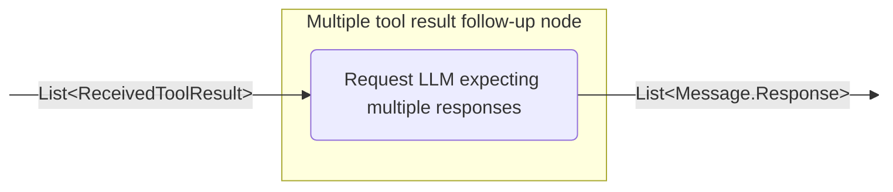
<!--- KNIT example-nodes-and-component-14.txt -->

You can use this node for the following purposes:

- Process the results of multiple tool executions.
- Generate multiple tool calls.
- Implement complex workflows with multiple parallel actions.

Here is an example:

=== "Kotlin"

    <!--- INCLUDE
    import ai.koog.agents.core.dsl.builder.strategy
    import ai.koog.agents.core.dsl.builder.node
    import ai.koog.agents.core.dsl.extension.nodeLLMSendToolResults
    import ai.koog.agents.core.dsl.extension.nodeExecuteTools
    val strategy = strategy<String, String>("strategy_name") {
    -->
    <!--- SUFFIX
    }
    -->
    ```kotlin
    val executeTools by nodeExecuteTools(parallel = true)
    val sendToolResultsToLLM by nodeLLMSendToolResults()
    edge(executeTools forwardTo sendToolResultsToLLM)
    ```
    <!--- KNIT example-nodes-and-component-10.kt -->

=== "Java"
    
    <!--- INCLUDE
    import ai.koog.agents.core.agent.entity.AIAgentGraphStrategy;
    import ai.koog.agents.core.agent.entity.AIAgentNode;
    import ai.koog.prompt.message.Message;
    class exampleNodesAndComponentsJava10 {
        public static void main(String[] args) {
            var strategy = AIAgentGraphStrategy.builder("strategy_name")
                .withInput(String.class)
                .withOutput(String.class);
    -->
    <!--- SUFFIX
        }
    }
    -->
    ```java
    var executeTools = AIAgentNode.executeTools("executeTools");
    var sendToolResultsToLLM = AIAgentNode.llmSendToolResults("sendToolResultsToLLM");

    strategy.edge(executeTools, sendToolResultsToLLM);
    ```
    <!--- KNIT exampleNodesAndComponentsJava10.java -->

## Node output transformation

The framework provides the `transform` extension function in Kotlin that allows you to create 
transformed versions of nodes that apply transformations to their output. In Java, you achieve 
the same result by creating intermediate nodes with explicit transformations. This is useful 
when you need to convert the output of a node to a different type or format while preserving the
original node's functionality.

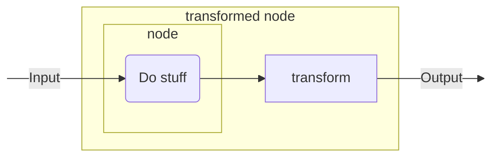
<!--- KNIT example-nodes-and-component-15.txt -->

### Node transformation

In Kotlin, the [transform()](api:agents-core::ai.koog.agents.core.dsl.builder.AIAgentNodeDelegate.transform) function creates a new `AIAgentNodeDelegate` that wraps the original node and applies a transformation function to its output. In Java, you need to manually compose nodes with transformation logic using `AIAgentNode.builder()` and explicit type parameters.

=== "Kotlin"

    <!--- INCLUDE
    /**
    -->
    <!--- SUFFIX
    **/
    -->
    ```kotlin
    inline fun <reified T> AIAgentNodeDelegate<Input, Output>.transform(
        noinline transformation: suspend (Output) -> T
    ): AIAgentNodeDelegate<Input, T>
    ```
    <!--- KNIT example-nodes-and-component-11.kt -->

=== "Java"

    ```java
    // In Java, you need to manually compose nodes
    // with transformation logic using AIAgentNode.builder() and explicit type parameters.
    // See the examples below for the Java approach to node transformations.
    ```
    <!--- KNIT example-nodes-and-component-java-01.java -->

#### Custom node transformation

Transform the output of a custom node to a different data type:

=== "Kotlin"

    <!--- INCLUDE
    import ai.koog.agents.core.dsl.builder.strategy
    import ai.koog.agents.core.dsl.builder.node
    import ai.koog.agents.core.dsl.extension.nodeDoNothing
    val strategy = strategy<String, Int>("strategy_name") {
    -->
    <!--- SUFFIX
    }
    -->
    ```kotlin
    val textNode by nodeDoNothing<String>("textNode").transform<Int> { text ->
        text.split(" ").filter { it.isNotBlank() }.size
    }

    edge(nodeStart forwardTo textNode)
    edge(textNode forwardTo nodeFinish)
    ```
    <!--- KNIT example-nodes-and-component-12.kt -->

=== "Java"
    
    <!--- INCLUDE
    import ai.koog.agents.core.agent.entity.AIAgentGraphStrategy;
    import ai.koog.agents.core.agent.entity.AIAgentNode;
    class exampleNodesAndComponentsJava11 {
        public static void main(String[] args) {
            var strategy = AIAgentGraphStrategy.builder("strategy_name")
                .withInput(String.class)
                .withOutput(Integer.class);
    -->
    <!--- SUFFIX
        }
    }
    -->
    ```java
    var textNode = AIAgentNode.builder("textNode")
        .withInput(String.class)
        .withOutput(Integer.class)
        .withAction((text, ctx) -> {
            String[] words = text.split(" ");
            int count = 0;
            for (String word : words) {
                if (!word.isBlank()) {
                    count++;
                }
            }
            return count;
        })
        .build();

    strategy.edge(strategy.nodeStart, textNode);
    strategy.edge(textNode, strategy.nodeFinish);
    ```
    <!--- KNIT exampleNodesAndComponentsJava11.java -->

#### Built-in node transformation

Transform the output of built-in nodes like `nodeLLMRequest` (Kotlin) or `AIAgentNode.llmRequest()` (Java):

=== "Kotlin"

    <!--- INCLUDE
    import ai.koog.agents.core.dsl.builder.strategy
    import ai.koog.agents.core.dsl.builder.node
    import ai.koog.agents.core.dsl.extension.nodeLLMRequest
    import ai.koog.prompt.message.MessagePart
    val strategy = strategy<String, Int>("strategy_name") {
    -->
    <!--- SUFFIX
    }
    -->
    ```kotlin
    val lengthNode by nodeLLMRequest("llmRequest").transform<Int> { assistantMessage ->
        assistantMessage.parts.filterIsInstance<MessagePart.Text>().joinToString("\n") { it.text }.length
    }

    edge(nodeStart forwardTo lengthNode)
    edge(lengthNode forwardTo nodeFinish)
    ```
    <!--- KNIT example-nodes-and-component-13.kt -->

=== "Java"
    
    <!--- INCLUDE
    import ai.koog.agents.core.agent.entity.AIAgentEdge;
    import ai.koog.agents.core.agent.entity.AIAgentGraphStrategy;
    import ai.koog.agents.core.agent.entity.AIAgentNode;
    import ai.koog.prompt.message.Message;
    import ai.koog.prompt.message.MessagePart;
    import java.util.stream.Collectors;
    class exampleNodesAndComponentsJava12 {
        public static void main(String[] args) {
            var strategy = AIAgentGraphStrategy.builder("strategy_name")
                .withInput(String.class)
                .withOutput(Integer.class);
    -->
    <!--- SUFFIX
        }
    }
    -->
    ```java
    var llmRequest = AIAgentNode.llmRequest("llmRequest");
    var lengthNode = AIAgentNode.builder("lengthNode")
        .withInput(Message.Assistant.class)
        .withOutput(Integer.class)
        .withAction((assistantMessage, ctx) -> {
            String text = assistantMessage.getParts().stream()
                .filter(p -> p instanceof MessagePart.Text)
                .map(p -> ((MessagePart.Text) p).getText())
                .collect(Collectors.joining());
            return text.length();
        })
        .build();

    strategy.edge(AIAgentEdge.builder()
        .from(strategy.nodeStart)
        .to(llmRequest)
        .build());
    strategy.edge(llmRequest, lengthNode);
    strategy.edge(lengthNode, strategy.nodeFinish);
    ```
    <!--- KNIT exampleNodesAndComponentsJava12.java -->


## Predefined subgraphs

The framework provides predefined subgraphs that encapsulate commonly used patterns and workflows. These subgraphs simplify the development of complex agent strategies by handling the creation of base nodes and edges automatically. The API is consistent between Kotlin and Java, with Kotlin using DSL functions and Java using builder methods.

By using the predefined subgraphs, you can implement various popular pipelines. Here is an example:

1. Prepare the data.
2. Run the task.
3. Validate the task results. If the results are incorrect, return to step 2 with a feedback message to make adjustments.

### Task execution subgraph

A subgraph that performs a specific task using provided tools and returns a structured result. It supports multi-response LLM interactions (the assistant may produce several responses interleaved with tool calls) and lets you control how tool calls are executed. In Kotlin, use [subgraphWithTask()](api:agents-core::ai.koog.agents.ext.agent.subgraphWithTask), and in Java, use [AIAgentSubgraph.builder().withTask()](api:agents-core::ai.koog.agents.core.agent.entity.TypedAIAgentSubgraphBuilder.withTask).

You can use this subgraph for the following purposes:

- Create special components that handle specific tasks within a larger workflow.
- Encapsulate complex logic with clear input and output interfaces.
- Configure task-specific tools, models, and prompts.
- Manage conversation history with automatic compression.
- Develop structured agent workflows and task execution pipelines.
- Generate structured results from LLM task execution, including flows with multiple assistant responses and tool invocations.

The API allows you to fine‑tune execution with optional parameters:

- [runMode](api:agents-core::ai.koog.agents.core.agent.entity.SubgraphWithTaskBuilder.runMode): controls how tool calls are executed during the task (sequential by default). Use this to switch between different tool execution strategies when supported by the underlying model/executor.
- [assistantResponseRepeatMax](api:agents-core::ai.koog.agents.core.agent.entity.SubgraphWithTaskBuilder.assistantResponseRepeatMax
  ): limits how many assistant responses are allowed before concluding the task cannot be completed (defaults to a safe internal limit if not provided).

You can provide a task to the subgraph as text, configure the LLM if needed, and provide the necessary tools, and the subgraph will process and solve the task. Here is an example:

=== "Kotlin"

    <!--- INCLUDE
    import ai.koog.agents.core.dsl.builder.strategy
    import ai.koog.agents.core.dsl.builder.node
    import ai.koog.agents.ext.tool.SayToUser
    import ai.koog.prompt.executor.clients.openai.OpenAIModels
    import ai.koog.agents.ext.agent.subgraphWithTask
    val searchTool = SayToUser
    val calculatorTool = SayToUser
    val weatherTool = SayToUser
    val strategy = strategy<String, String>("strategy_name") {
    -->
    <!--- SUFFIX
    }
    -->
    ```kotlin
    val processQuery by subgraphWithTask<String, String>(
        tools = listOf(searchTool, calculatorTool, weatherTool),
        llmModel = OpenAIModels.Chat.GPT4o,
        parallelTools = false,
        assistantResponseRepeatMax = 3,
    ) { userQuery ->
        """
        You are a helpful assistant that can answer questions about various topics.
        Please help with the following query:
        $userQuery
        """
    }
    ```
    <!--- KNIT example-nodes-and-component-14.kt -->

=== "Java"
    
    <!--- INCLUDE
    import ai.koog.agents.core.agent.entity.AIAgentGraphStrategy;
    import ai.koog.agents.core.agent.entity.AIAgentSubgraph;
    import ai.koog.agents.ext.tool.SayToUser;
    import java.util.List;
    class exampleNodesAndComponentsJava13 {
        public static void main(String[] args) {
            var strategy = AIAgentGraphStrategy.builder("strategy_name")
                .withInput(String.class)
                .withOutput(String.class);
            SayToUser searchTool = SayToUser.INSTANCE;
            SayToUser calculatorTool = SayToUser.INSTANCE;
            SayToUser weatherTool = SayToUser.INSTANCE;
    -->
    <!--- SUFFIX
        }
    }
    -->
    ```java
    var processQuery = AIAgentSubgraph.builder("processQuery")
        .limitedTools(List.of(searchTool, calculatorTool, weatherTool))
        .withInput(String.class)
        .withOutput(String.class)
        .withTask(userQuery ->
            "You are a helpful assistant that can answer questions about various topics.\n" +
            "Please help with the following query:\n" +
            userQuery)
        .parallelTools(false)
        .assistantResponseRepeatMax(3)
        .build();
    ```
    <!--- KNIT exampleNodesAndComponentsJava13.java -->

### Task execution subgraph with verification

A special version of `subgraphWithTask` that verifies whether a task was performed correctly and provides details about any issues encountered. This subgraph is useful for workflows that require validation or quality checks. In Kotlin, use [subgraphWithVerification()](api:agents-core::ai.koog.agents.ext.agent.subgraphWithVerification
), and in Java, use `AIAgentSubgraph.builder().withVerification()`.

You can use this subgraph for the following purposes:

- Verify the correctness of task execution.
- Implement quality control processes in your workflows.
- Create self-validating components.
- Generate structured verification results with success/failure status and detailed feedback.

The subgraph ensures that the LLM calls a verification tool at the end of the workflow to check whether the task was successfully completed. It guarantees this verification is performed as the final step and returns a [CriticResult](api:agents-core::ai.koog.agents.ext.agent.CriticResult) that indicates whether a task was completed successfully and provides detailed feedback.
Here is an example:

=== "Kotlin"

    <!--- INCLUDE
    import ai.koog.agents.core.dsl.builder.strategy
    import ai.koog.agents.core.dsl.builder.node
    import ai.koog.agents.ext.tool.SayToUser
    import ai.koog.prompt.executor.clients.anthropic.AnthropicModels
    import ai.koog.agents.ext.agent.subgraphWithVerification
    val runTestsTool = SayToUser
    val analyzeTool = SayToUser
    val readFileTool = SayToUser
    val strategy = strategy<String, String>("strategy_name") {
    -->
    <!--- SUFFIX
    }
    -->
    ```kotlin
    val verifyCode by subgraphWithVerification<String>(
        tools = listOf(runTestsTool, analyzeTool, readFileTool),
        llmModel = AnthropicModels.Opus_4_6,
        parallelTools = false,
        assistantResponseRepeatMax = 3,
    ) { codeToVerify ->
        """
        You are a code reviewer. Please verify that the following code meets all requirements:
        1. It compiles without errors
        2. All tests pass
        3. It follows the project's coding standards

        Code to verify:
        $codeToVerify
        """
    }
    ```
    <!--- KNIT example-nodes-and-component-15.kt -->

=== "Java"

    <!--- INCLUDE
    import ai.koog.agents.core.agent.entity.AIAgentGraphStrategy;
    import ai.koog.agents.core.agent.entity.AIAgentSubgraph;
    import ai.koog.agents.ext.tool.SayToUser;
    import java.util.List;
    class exampleNodesAndComponentsJava14 {
        public static void main(String[] args) {
            var strategy = AIAgentGraphStrategy.builder("strategy_name")
                .withInput(String.class)
                .withOutput(String.class);
            SayToUser runTestsTool = SayToUser.INSTANCE;
            SayToUser analyzeTool = SayToUser.INSTANCE;
            SayToUser readFileTool = SayToUser.INSTANCE;
    -->
    <!--- SUFFIX
        }
    }
    -->
    ```java
    var verifyCode = AIAgentSubgraph.builder("verifyCode")
        .limitedTools(List.of(runTestsTool, analyzeTool, readFileTool))
        .withInput(String.class)
        .withVerification(codeToVerify ->
            "You are a code reviewer. Please verify that the following code meets all requirements:\n" +
            "1. It compiles without errors\n" +
            "2. All tests pass\n" +
            "3. It follows the project's coding standards\n\n" +
            "Code to verify:\n" +
            codeToVerify)
        .parallelTools(false)
        .assistantResponseRepeatMax(3)
        .build();
    ```
    <!--- KNIT exampleNodesAndComponentsJava14.java -->

## Predefined strategies and common strategy patterns

Koog provides predefined strategies that combine various nodes.
The nodes are connected using edges to define the flow of operations, with conditions that specify when to follow each edge.

You can integrate these strategies into your agent workflows if needed.

### Single run strategy

A single run strategy is designed for non-interactive use cases where the agent processes input once and
returns a result.

You can use this strategy when you need to run straightforward processes that do not require complex logic.

=== "Kotlin"

    <!--- INCLUDE
    import ai.koog.agents.core.agent.entity.AIAgentGraphStrategy
    import ai.koog.agents.core.dsl.builder.strategy
    import ai.koog.agents.core.dsl.builder.node
    import ai.koog.agents.core.dsl.extension.*
    -->
    ```kotlin
    public fun singleRunStrategy(): AIAgentGraphStrategy<String, String> = strategy("single_run") {
        val nodeCallLLM by nodeLLMRequest("sendInput")
        val nodeExecuteTool by nodeExecuteTools("nodeExecuteTool")
        val nodeSendToolResult by nodeLLMSendToolResults("nodeSendToolResult")

        edge(nodeStart forwardTo nodeCallLLM)
        edge(nodeCallLLM forwardTo nodeExecuteTool onToolCalls { true })
        edge(nodeCallLLM forwardTo nodeFinish onTextMessage { true })
        edge(nodeExecuteTool forwardTo nodeSendToolResult)
        edge(nodeSendToolResult forwardTo nodeFinish onTextMessage { true })
        edge(nodeSendToolResult forwardTo nodeExecuteTool onToolCalls { true })
    }
    ```
    <!--- KNIT example-nodes-and-component-16.kt -->

=== "Java"
    
    <!--- INCLUDE
    import ai.koog.agents.core.agent.entity.AIAgentEdge;
    import ai.koog.agents.core.agent.entity.AIAgentGraphStrategy;
    import ai.koog.agents.core.agent.entity.AIAgentNode;
    import ai.koog.prompt.message.Message;
    import ai.koog.prompt.message.MessagePart;
    import java.util.stream.Collectors;
    class exampleNodesAndComponentsJava15 {
    -->
    <!--- SUFFIX
        public static void main(String[] args) {
        }
    }
    -->
    ```java
    public static AIAgentGraphStrategy<String, String> singleRunStrategy() {
        var strategy = AIAgentGraphStrategy.builder("single_run")
            .withInput(String.class)
            .withOutput(String.class);

        var nodeCallLLM = AIAgentNode.llmRequest("sendInput");
        var nodeExecuteTool = AIAgentNode.executeTools("nodeExecuteTool");
        var nodeSendToolResult = AIAgentNode.llmSendToolResults("nodeSendToolResult");

        strategy.edge(AIAgentEdge.builder()
            .from(strategy.nodeStart)
            .to(nodeCallLLM)
            .build());

        strategy.edge(AIAgentEdge.builder()
            .from(nodeCallLLM)
            .to(nodeExecuteTool)
            .onToolCalls()
            .build());

        strategy.edge(AIAgentEdge.builder()
            .from(nodeCallLLM)
            .to(strategy.nodeFinish)
            .onTextMessage()
            .build());

        strategy.edge(nodeExecuteTool, nodeSendToolResult);

        strategy.edge(AIAgentEdge.builder()
            .from(nodeSendToolResult)
            .to(strategy.nodeFinish)
            .onTextMessage()
            .build());

        strategy.edge(AIAgentEdge.builder()
            .from(nodeSendToolResult)
            .to(nodeExecuteTool)
            .onToolCalls()
            .build());

        return strategy.build();
    }
    ```
    <!--- KNIT exampleNodesAndComponentsJava15.java -->

### Tool-based strategy

A tool-based strategy is designed for workflows that heavily rely on tools to perform specific operations.
It typically executes tools based on the LLM decisions and processes the results.

=== "Kotlin"

    <!--- INCLUDE
    import ai.koog.agents.core.agent.entity.AIAgentGraphStrategy
    import ai.koog.agents.core.dsl.builder.strategy
    import ai.koog.agents.core.dsl.builder.node
    import ai.koog.agents.core.dsl.extension.*
    import ai.koog.agents.core.tools.ToolRegistry
    -->
    ```kotlin
    fun toolBasedStrategy(name: String, toolRegistry: ToolRegistry): AIAgentGraphStrategy<String, String> {
        return strategy(name) {
            val nodeSendInput by nodeLLMRequest()
            val nodeExecuteTool by nodeExecuteTools()
            val nodeSendToolResult by nodeLLMSendToolResults()

            // Define the flow of the agent
            edge(nodeStart forwardTo nodeSendInput)

            // If the LLM responds with a message, finish
            edge(
                (nodeSendInput forwardTo nodeFinish)
                        onTextMessage { true }
            )

            // If the LLM calls a tool, execute it
            edge(
                (nodeSendInput forwardTo nodeExecuteTool)
                        onToolCalls { true }
            )

            // Send the tool result back to the LLM
            edge(nodeExecuteTool forwardTo nodeSendToolResult)

            // If the LLM calls another tool, execute it
            edge(
                (nodeSendToolResult forwardTo nodeExecuteTool)
                        onToolCalls { true }
            )

            // If the LLM responds with a message, finish
            edge(
                (nodeSendToolResult forwardTo nodeFinish)
                        onTextMessage { true }
            )
        }
    }
    ```
    <!--- KNIT example-nodes-and-component-17.kt -->

=== "Java"
    
    <!--- INCLUDE
    import ai.koog.agents.core.agent.entity.AIAgentEdge;
    import ai.koog.agents.core.agent.entity.AIAgentGraphStrategy;
    import ai.koog.agents.core.agent.entity.AIAgentNode;
    import ai.koog.prompt.message.Message;
    import ai.koog.prompt.message.MessagePart;
    import ai.koog.agents.core.tools.ToolRegistry;
    import java.util.stream.Collectors;
    class exampleNodesAndComponentsJava16 {
    -->
    <!--- SUFFIX
        public static void main(String[] args) {
        }
    }
    -->
    ```java
    public static AIAgentGraphStrategy<String, String> toolBasedStrategy(String name, ToolRegistry toolRegistry) {
        var strategy = AIAgentGraphStrategy.builder(name)
            .withInput(String.class)
            .withOutput(String.class);

        var nodeSendInput = AIAgentNode.llmRequest("nodeSendInput");
        var nodeExecuteTool = AIAgentNode.executeTools("nodeExecuteTool");
        var nodeSendToolResult = AIAgentNode.llmSendToolResults("nodeSendToolResult");

        // Define the flow of the agent
        strategy.edge(AIAgentEdge.builder()
            .from(strategy.nodeStart)
            .to(nodeSendInput)
            .build());

        // If the LLM responds with a message, finish
        strategy.edge(AIAgentEdge.builder()
            .from(nodeSendInput)
            .to(strategy.nodeFinish)
            .onTextMessage()
            .build());

        // If the LLM calls a tool, execute it
        strategy.edge(AIAgentEdge.builder()
            .from(nodeSendInput)
            .to(nodeExecuteTool)
            .onToolCalls(call -> true)
            .build());

        // Send the tool result back to the LLM
        strategy.edge(nodeExecuteTool, nodeSendToolResult);

        // If the LLM calls another tool, execute it
        strategy.edge(AIAgentEdge.builder()
            .from(nodeSendToolResult)
            .to(nodeExecuteTool)
            .onToolCalls()
            .build());

        // If the LLM responds with a message, finish
        strategy.edge(AIAgentEdge.builder()
            .from(nodeSendToolResult)
            .to(strategy.nodeFinish)
            .onTextMessage()
            .build());

        return strategy.build();
    }
    ```
    <!--- KNIT exampleNodesAndComponentsJava16.java -->

### Streaming data strategy

A streaming data strategy is designed for processing streaming data from the LLM. It typically requests
streaming data, processes it, and potentially calls tools with the processed data.


=== "Kotlin"

    <!--- INCLUDE
    import ai.koog.agents.core.dsl.builder.strategy
    import ai.koog.agents.core.dsl.builder.node
    import ai.koog.agents.example.exampleStreamingApi05.Book
    import ai.koog.agents.example.exampleStreamingApi06.markdownBookDefinition
    import ai.koog.agents.example.exampleStreamingApi08.parseMarkdownStreamToBooks
    -->
    ```kotlin
    val agentStrategy = strategy<String, List<Book>>("library-assistant") {
        // Describe the node containing the output stream parsing
        val getMdOutput by node<String, List<Book>> { booksDescription ->
            val books = mutableListOf<Book>()
            val mdDefinition = markdownBookDefinition()

            llm.writeSession {
                appendPrompt { user(booksDescription) }
                // Initiate the response stream in the form of the definition `mdDefinition`
                val markdownStream = requestLLMStreaming(mdDefinition)
                // Call the parser with the result of the response stream and perform actions with the result
                parseMarkdownStreamToBooks(markdownStream).collect { book ->
                    books.add(book)
                    println("Parsed Book: ${book.title} by ${book.author}")
                }
            }

            books
        }
        // Describe the agent's graph making sure the node is accessible
        edge(nodeStart forwardTo getMdOutput)
        edge(getMdOutput forwardTo nodeFinish)
    }
    ```
    <!--- KNIT example-nodes-and-component-18.kt -->

=== "Java"

    <!--- INCLUDE
    import ai.koog.agents.core.agent.entity.AIAgentGraphStrategy;
    import ai.koog.agents.core.agent.entity.AIAgentNode;
    import ai.koog.prompt.streaming.StreamFrame;
    import ai.koog.prompt.structure.StructureDefinition;
    import ai.koog.prompt.structure.markdown.MarkdownStructureDefinition;
    import ai.koog.serialization.TypeCapture;
    import ai.koog.serialization.TypeToken;
    import java.util.ArrayList;
    import java.util.List;
    import java.util.concurrent.Flow;
    class exampleNodesAndComponentsJava17 {
        class Book {
            String getTitle() {
                return "";
            }
            String getAuthor() {
                return "";
            }
        }
        public static MarkdownStructureDefinition markdownBookDefinition() {
            return null;
        }
        public static Flow.Publisher<Book> parseMarkdownStreamToBooks(Flow.Publisher<StreamFrame> markdownStream) {
            return null;
        }
        public static void main(String[] args) {
    -->
    <!--- SUFFIX
        }
    }
    -->
    ```java
    var strategy = AIAgentGraphStrategy.builder()
        .withInput(String.class)
        .withOutput(List.class);

    var getMdOutput = AIAgentNode.builder()
        .withInput(String.class)
        .<List<Book>>withOutput(TypeToken.of(new TypeCapture<List<Book>>() {}))
        .withAction((booksDescription, ctx) -> {
            var books = new ArrayList<Book>();
            StructureDefinition mdDefinition = markdownBookDefinition();

            ctx.getLlm().writeSession(session -> {
                session.appendPrompt(prompt -> {
                    prompt.user(booksDescription);
                });

                // Initiate the response stream in the form of the definition `mdDefinition`
                var markdownStream = session.requestLLMStreaming(mdDefinition);
                // Call the parser with the result of the response stream and perform actions with the result
                parseMarkdownStreamToBooks(markdownStream).subscribe(new Flow.Subscriber<>() {
                    @Override
                    public void onSubscribe(Flow.Subscription subscription) {
                    }

                    @Override
                    public void onNext(Book book) {
                        books.add(book);
                        System.out.println("Parsed Book: " + book.getTitle() + " by " + book.getAuthor());
                    }

                    @Override
                    public void onError(Throwable throwable) {
                    }

                    @Override
                    public void onComplete() {
                    }
                });

                return null;
            });

            return books;
        })
        .build();

    strategy.edge(strategy.nodeStart, getMdOutput);
    strategy.edge(getMdOutput, strategy.nodeFinish);
    ```
    <!--- KNIT exampleNodesAndComponentsJava17.java -->
